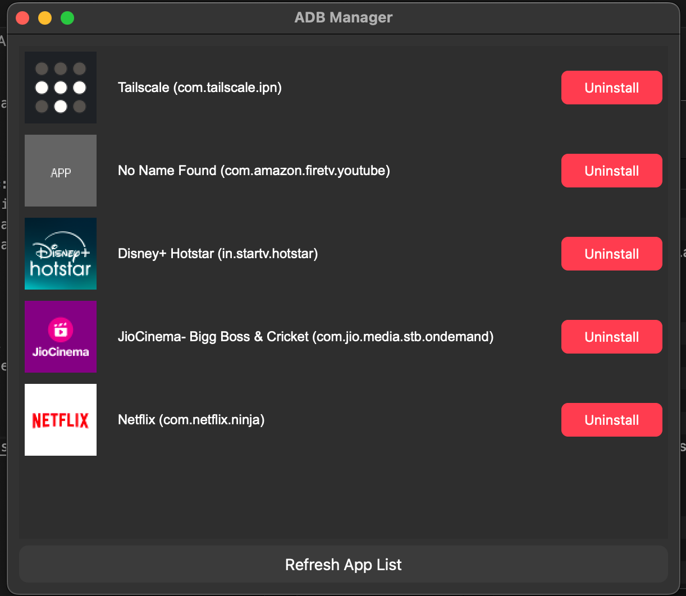

# ADB Manager

ADB Manager is a Python-based application with a GUI that allows users to manage Android applications on a connected device. With ADB Manager, you can view installed apps, uninstall apps, and install APK files via drag-and-drop.

## Features

- **View Installed Apps**: See a list of all installed applications on a connected Android device.
- **Uninstall Apps**: Easily uninstall applications from the device.
- **Install APKs**: Drag and drop APK files into the app to install them on the connected device.
- **Progress Bar**: Displays a progress bar while loading the list of installed apps.

## Requirements

- Python 3.7+
- Android device with ADB enabled
- `adb` installed and accessible in your system's PATH

## Screenshot

